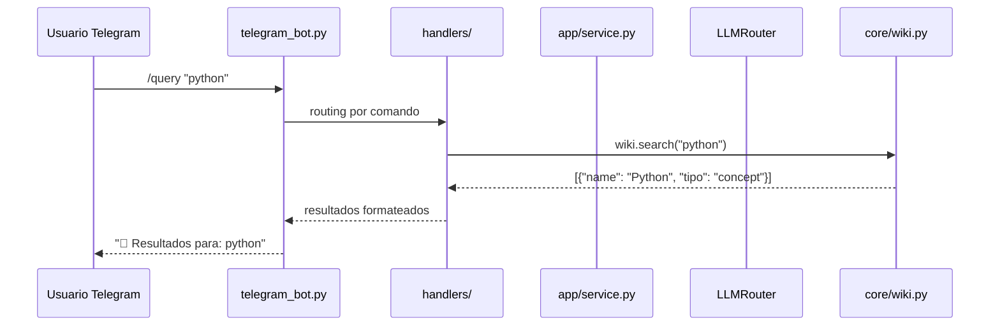
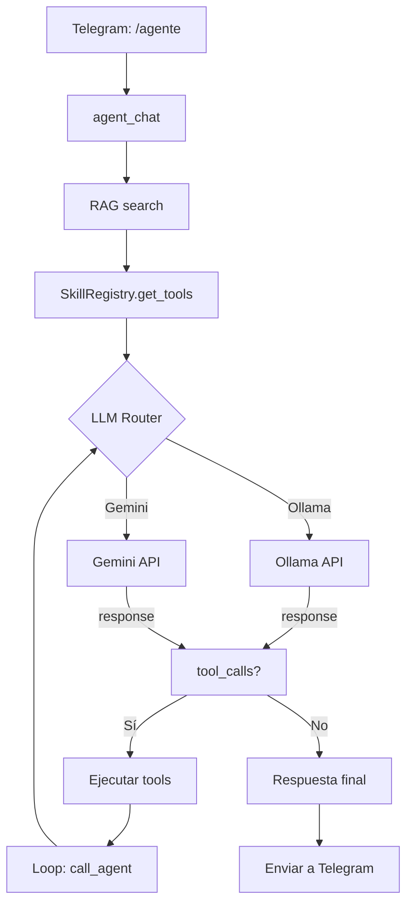
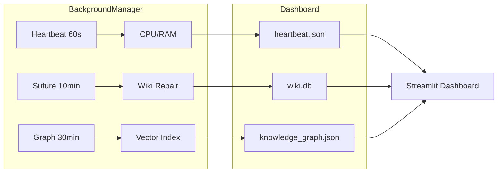
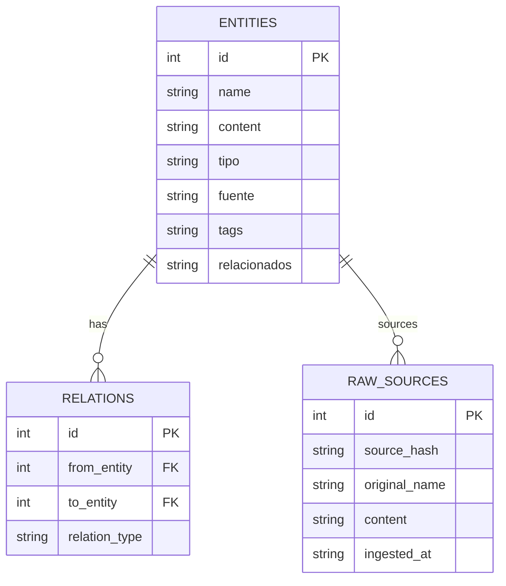
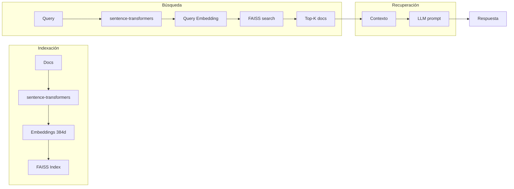

# Diagramas de Flujo de Datos

Este documento contiene diagramas de arquitectura del sistema Asubarnipal.

## Diagrama 1: Flujo de un mensaje de Telegram



## Diagrama 2: Flujo del Agente Autónimo



## Diagrama 3: Arquitectura de Background Rituals



## Diagrama 4: Flujo de Ingesta de URL

```mermaid
flowchart TD
    A[/ingest <url>] --> B[requests.get]
    B --> C{Status 200?}
    C -->|No| D[Error: HTTP]
    C -->|Sí| E[BeautifulSoup]
    E --> F[Limpiar HTML]
    F --> G[Detectar idioma]
    G --> H{Traducir?}
    H -->|Sí| I[Google Translator]
    H -->|No| J[Continuar]
    I --> J
    J --> K[LLM: generar resumen]
    K --> L[Extraer conceptos]
    L --> M[Crear entidades]
    M --> N[Relacionar notas]
    N --> O[Commit SQLite]
    O --> P[Respuesta a Telegram]
```

## Diagrama 5: Sistema de Chat Modes

```mermaid
flowchart TD
    A[/charlar <modo> <tema>] --> B{Modo válido?}
    B -->|No| C[Mostrar modos]
    B -->|Sí| D{Seleccionar modo}
    D -->|libre| E[Conversación natural]
    D -->|consultor| F[3 fases]
    D -->|devil| G[Crítica implacable]
    D -->|socrático| H[Preguntas]
    D -->|lateral| I[5 perspectivas]

    E --> J[AgentService]
    F --> J
    G --> J
    H --> J
    I --> J

    J --> K[LLM con system prompt]
    K --> L[Respuesta Telegram]
```

## Diagrama 6: Estructura de datos del Wiki



## Diagrama 7: Pipeline de RAG



## Leyenda

- `→` Flujo principal
- `-->` Retorno de datos
- `{}` Decisión/condición
- `[]` Proceso
- `||--o{` Relación SQL